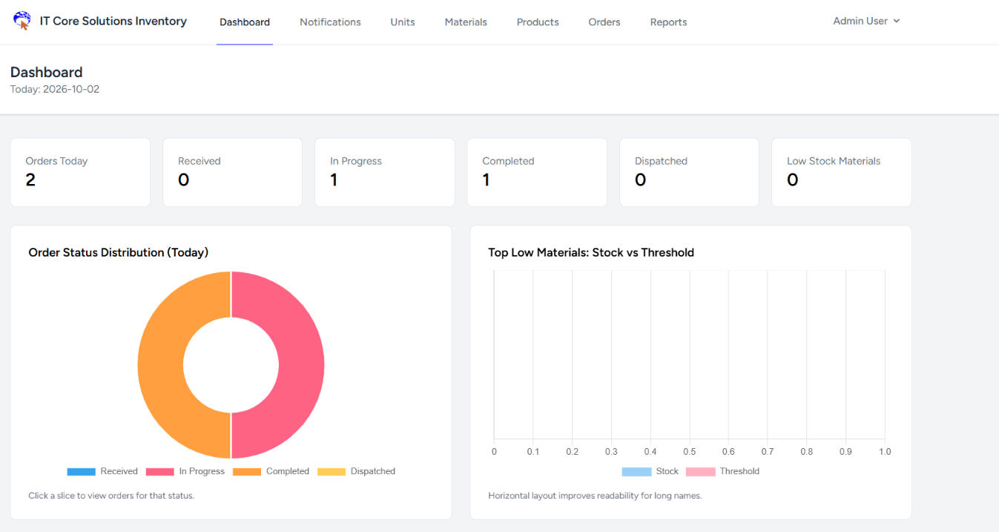
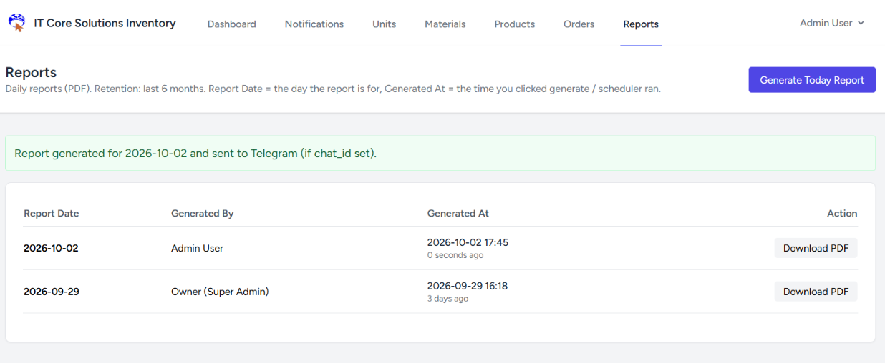
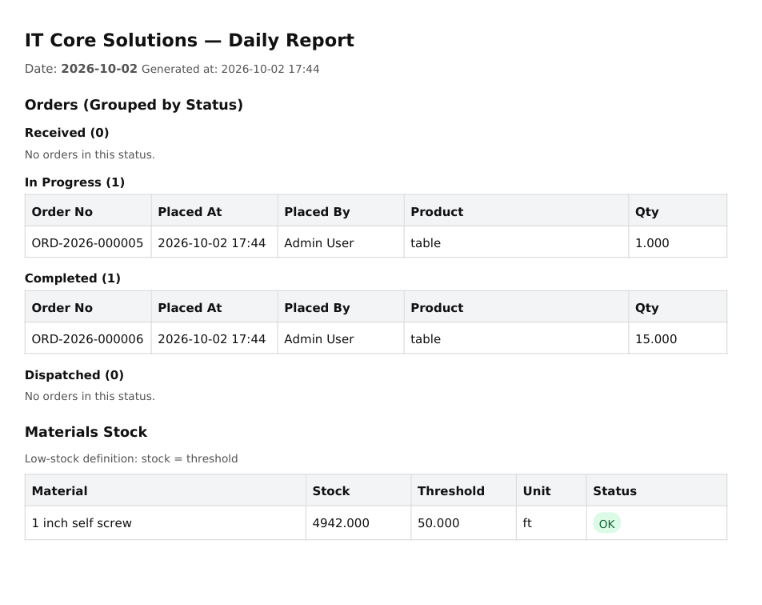

# ICS Inventory Management System

A role-based inventory and production-order management system built with **Laravel 12, PHP 8.2+, SQLite/MySQL, Blade, and Tailwind CSS**.

The application manages raw materials, units, composite materials, product bills of materials (BOMs), stock movements, production orders, reports, notifications, and user permissions from a single web interface.

---

## Application Preview

### Inventory Dashboard

The dashboard provides an overview of daily orders, order statuses, completed and dispatched orders, and low-stock materials.



### Reports Management

The reports section provides daily report generation, report history, PDF downloads, and optional Telegram delivery.



### Generated Daily Report

Generated reports contain order information grouped by status together with material stock, thresholds, units, and stock status.



---

## Overview

ICS Inventory is designed to support inventory and production workflows where materials are converted into products through defined bills of materials.

The system provides:

- Role-based access control
- Material and unit management
- Composite-material definitions
- Nested BOM expansion
- Product BOM management
- Stock availability checks
- Low-stock monitoring
- Transactional stock deductions
- Production-order lifecycle tracking
- Stock movement audit logs
- Daily PDF reports
- In-app notifications
- Optional Telegram notifications
- Scheduled report generation
- Report retention and cleanup
- Super Admin ownership transfer
- User and profile management
- Authentication and authorization

---

## Core Capabilities

### Role-Based Access Control

The application supports separate roles for different levels of access:

- **Operator**
- **Admin**
- **Super Admin**

Authorization is enforced through application roles and permissions.

---

### Material and Unit Management

Manage the materials used throughout the inventory system, including:

- Material definitions
- Units of measurement
- Stock quantities
- Stock thresholds
- Low-stock identification

The dashboard can surface materials whose stock reaches the configured threshold.

---

### Composite Materials

The system supports composite materials that can be built from multiple underlying materials.

Composite definitions can be expanded when calculating material requirements for production.

This allows inventory calculations to account for materials that themselves contain other materials.

---

### Product Bills of Materials

Products can have associated **Bills of Materials (BOMs)** defining the materials required to produce them.

The inventory workflow uses these definitions to determine material requirements before stock deductions.

---

### Stock Management

Inventory operations include:

- Stock availability checks
- Material quantity calculations
- Low-stock monitoring
- Stock deductions
- Stock movement tracking
- Transactional inventory updates

Critical stock deductions are performed inside database transactions, with row locking during the final deduction step to help maintain inventory consistency.

---

### Production Orders

The system provides an order lifecycle for production activities.

Orders can be tracked through statuses including:

- Received
- In Progress
- Completed
- Dispatched

The dashboard provides a daily summary of order activity and status distribution.

---

### Stock Movement Audit Logs

Inventory changes are recorded through stock movement records.

This provides a traceable history of inventory operations and supports auditing of stock changes.

---

### Daily PDF Reports

The application generates daily inventory reports containing:

- Orders grouped by status
- Order number
- Order creation time
- User who placed the order
- Product
- Quantity
- Material stock
- Stock threshold
- Unit
- Stock status

Reports can be generated manually and are also supported by scheduled report-generation commands.

---

### Report Retention

Generated reports are retained according to the application's configured retention workflow.

The project includes a command for removing reports older than six months:

```bash
php artisan reports:purge-old
